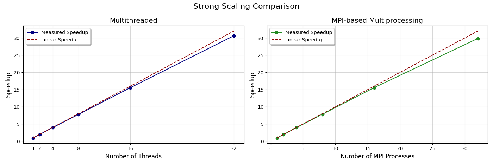
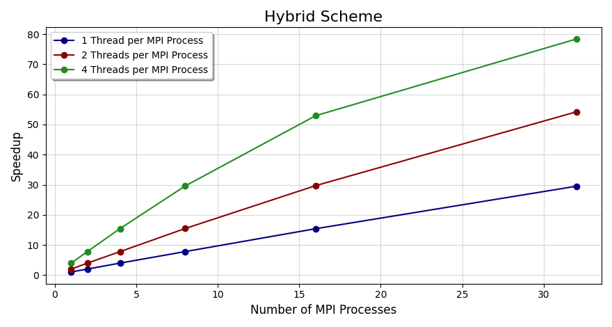

<h1 align="center">
<br>

<br>
<strong>Parallel Hooke-Jeeves Optimization</strong>
</h1>


<h3 align="center">


<br>
<br>

<i>A Rust-based implementation of parallel Hooke-Jeeves optimization, exploring parallelization schemes such as multithreading, process-based parallelism with MPI and hybrid approaches for efficient global optimization.</i>
</h3>
<br>

# 🚩 Table of Contents
* [Introduction](#introduction)
* [Installation](#installation)
* [Software Overview](#software-overview)
* [Tests and Results](#tests-and-results)
* [Contact](#Contact)
* [License](#License)


# Introduction

***Global optimization*** is a critical problem in applied mathematics with wide-ranging applications in fields such as economics, chemistry, biology and engineering. Unlike local optimization, which aims to find the minimum or maximum of an objective function in a localized region, global optimization seeks to identify the global extremum (minimum or maximum) of the objective function across the entire solution space, accounting for all local extrema.

A commonly employed strategy in global optimization is **Multistart Local Search**, where a local optimization algorithm is initialized from several randomly chosen starting points. This method enhances the likelihood of locating the global minimum by facilitating the exploration of multiple regions within the solution space. The success of this approach is contingent upon the ability of the local optimization algorithm to effectively traverse diverse areas of the search space. Parallelism is crucial to this process, as it allows for the concurrent execution of multiple local searches, thereby enhancing computational performance. By leveraging parallelism, the efficiency of the global optimization process is significantly improved, resulting in faster convergence and a higher likelihood of successfully identifying the global optimum.

The [Hooke-Jeeves][hooke-jeeves-link] direct search method is a well-known **derivative-free** optimization algorithm. It operates based on a pattern search strategy, iteratively exploring the search space by moving along predefined directions from the current point. If a direction yields a better objective function value, the current point is updated accordingly; otherwise, the search parameters are adjusted and the process is repeated. Its derivative-free nature makes the method particularly well-suited for optimization problems where the objective function is non-differentiable, discontinuous or computationally expensive, ensuring effective exploration of the solution space even in the absence of gradient information.

In this project, various parallelization schemes are applied at the **trial level** to enhance the efficiency of the Hooke-Jeeves method in locating the global minimum of an objective function. By distributing the optimization trials across multiple workers, the search for the global optimum can be conducted simultaneously in different regions of the solution space. This parallelization accelerates the optimization process, reducing computation time and increasing the chances of identifying the global minimum.

The **Rosenbrock function** (also known as the banana function) is chosen as the objective function for this optimization task. It is mathematically defined as:

$$f(x) = \sum_{i=1}^{n-1} \left( 100 \cdot (x_{i+1} - x_i^2)^2 + (1 - x_i)^2 \right)$$

The Rosenbrock function is a common benchmark for optimization algorithms, having a global minimum at $(1, 1, \dots, 1)$, where the function value is 0. This function is non-convex, which poses challenges for gradient-based optimization methods, making it a good test case for global optimization algorithms. For more details, refer [here][rosenbrock-link].

> [!INFO]  
> An implementation of the Hooke-Jeeves method in C is available at [NetLib][netlib-link]. This implementation computes a point $X$ where the nonlinear function $f(X)$ achieves a local minimum. The objective function $f(X)$ is scalar, defined as: $f: \mathbb{R}^n \to \mathbb{R}^1$. The Rust implementation of the Hooke-Jeeves method in this project is based on this C implementation from NetLib.

# Installation

To get started with this project, ensure that the following prerequisites are met:

1. **Rust** (edition >= **2021**) is installed on your system.    

2. An **MPI** implementation is installed, such as:  
   - [OpenMPI](open-mpi-link)  
   - [MPICH](mpich-link)  

Ensure that the `mpirun` command is available in your system's **PATH** for running the MPI-based binaries.

1. **Clone the repository and navigate to the project's directory**:  
   ```bash
   git clone https://github.com/Sofosss/CEID-Parallel_Hooke-Jeeves.git
   cd CEID-Parallel_Hooke-Jeeves
   ```
2. **The project includes 4 binary crates (each corresponding to a different scheme of the Hooke-Jeeves Method (multithreading, multiprocessing, hybrid and sequential)). Install them with**:
    ```bash
    cargo install --path .
    ```
> [!NOTE]
> The binaries will be installed in the ~/.cargo/bin directory. Make sure this directory is included in your **PATH**.

3. **Alternatively, build and copy the binaries manually**:
    ```bash
    cargo build --release
    # Repeat the cp command for each binary crate as required
    cp ./target/release/<binary-name> /usr/local/bin
    ```
4. **Verify installation**:
    ```bash
    # Ensure the binaries are installed correctly by checking their versions
    <binary-name> --version
    ```

## Execution Instructions

All binaries require two mandatory arguments:  
- **nvars**: Number of variables in the optimization problem.  
- **ntrials**: Number of trials to perform.  

### Scheme-Specific Execution Requirements

- **Multithreading**:  
  Requires an additional argument specifying the number of **threads**.  
  ```bash
  threads_hj <nvars> <ntrials> <nthreads>
  ```
- **Multiprocessing (MPI)**:
    Requires execution via mpirun or a compatible MPI runner. Specify the number of **processes** using -n or -np.
    ```bash
    mpirun -n <nprocesses> mpi_hj <nvars> <ntrials>
    ```
- **Hybrid (MPI + threads)**:
    Requires both the number of **processes** and **threads**.
    ```bash
    mpirun -n <nprocesses> hybrid_hj <nvars> <ntrials> <nthreads>
    ```
> [!INFO]
> If you prefer not to manually build or install the binaries using `cargo`, you can use the provided [script][run-link]. This script automates the process of building and running the required binary for any of the implemented schemes. To use the script, ensure it is executable by running the command `chmod +x run.sh`. Once the script is ready, you can run it by specifying the binary name along with the required arguments.

# Software Overview

In this project, three parallelization schemes for the Multistart Hooke-Jeeves Optimization Method are implemented, each designed to efficiently find the global minimum of the Rosenbrock objective function: 

1. **Multithreading**: In the multithreading scheme, parallelization is implemented using the [thread][std-thread-link] module from the Rust Standard Library. Multiple threads are spawned, each independently executing the Hooke-Jeeves method on distinct random starting points. Each thread identifies the local minimum within the trials it performs. The trials are distributed evenly across the threads, with the last thread assigned any remaining trials when the total number of trials is not perfectly divisible by the number of available threads. Once all threads have completed their assigned trials, the main thread gathers the results and determines the global minimum. This shared-memory approach leverages multi-core processors to accelerate the optimization process within a single computational node. The corresponding implementation is available [here][threads-link].

2. **Multiprocessing (MPI)**: In the MPI-based parallelization scheme, the optimization trials are distributed across multiple processes, with each process assigned a subset of trials based on its rank. Each process executes its trials and computes a local minimum. The main process collects the local minima from all processes using an MPI gather operation and identifies the global minimum by comparing these values. For MPI communication, the MPI Rust bindings provided by the [mpi crate][mpi-crate-link] are utilized. The code for the multiprocessing scheme can be found [here][mpi-procs-link].

3. **Hybrid Model (MPI processes + threads)**: A combination of multithreading and MPI-based multiprocessing is employed in this scheme. Each MPI process spawns multiple threads to further parallelize the workload within its assigned subset of trials. The threads within each MPI process independently execute the Hooke-Jeeves method on their allocated trials and compute their respective thread-local minima. Once all threads within a process complete execution, the main thread of that process identifies the process-local minimum by comparing the thread-local minima. The process-local minima are then communicated to the main MPI process, which gathers them using an MPI gather operation and determines the global minimum by comparing these values. This design efficiently combines multithreading for intra-process parallelism with MPI-based multiprocessing for inter-process parallelism. The implementation for this hybrid approach is available [here][hybrid-model-link].

> [!INFO] 
> The parallel implementations are based on the [sequential version][seq-vers-link] of the algorithm, which initiates $n_{\text{trials}}$ random starting points in a search space of $n_{\text{vars}}$ dimensions, applies the Hooke-Jeeves method to each starting point and determines the global minimum by comparing the outcomes across all trials. The search space for each dimension is constrained to the interval $[-5, 5]$ and the default parameters from the [NetLib implementation][netlib-link] of the Hooke-Jeeves algorithm are utilized.

# Tests and Results
To evaluate and compare the performance of the different parallelization schemes implemented for the Hooke-Jeeves method, the [benchmarking script](benchmark-link) was utilized. For each combination of workers' arguments, five runs were executed and the average result was taken. The tests were conducted using a fixed number of 32 variables (`nvars`) and 65536 trials (`ntrials`).

All executions were conducted on an Nvidia DGX system (128 logical CPU cores [64 physical cores - 2 threads per core], 1 TB of DDR4 RAM).

<br>
<p align="center">
 
    <br>
    <em><i>Figure 1: Comparison of speedup for multithreading and MPI-based multiprocessing schemes</i></em>
</p>

The graph above shows a comparison of speedup between the multithreading and MPI-based multiprocessing schemes, demonstrating how performance scales with different configurations.

<br>
<p align="center">
 
    <br>
    <em><i>Figure 2: Performance comparison of the hybrid scheme with 1, 2 and 4 threads per MPI process</i></em>
</p>

Figure 2 illustrates the performance of the hybrid scheme, comparing the speedup achieved with 1, 2 and 4 threads per MPI process.


# Contact

- Sofotasios Argiris | <a href="mailto:a.sofotasios@ceid.upatras.gr">a.sofotasios@ceid.upatras.gr</a>
- Metaxakis Dimitris | <a href="mailto:d.metaxakis@ceid.upatras.gr">d.metaxakis@ceid.upatras.gr</a>

# License

Distributed under the [MIT] License. See `LICENSE.md` for more details.

<!-- MARKDOWN LINKS & IMAGES -->
[rosenbrock-link]: https://en.wikipedia.org/wiki/Rosenbrock_function
[hooke-jeeves-link]: https://media.neliti.com/media/publications/411591-review-of-hooke-and-jeeves-direct-search-b7dfccd7.pdf
[netlib-link]: https://netlib.org/opt/hooke.c
[seq-vers-link]: ./Hooke_Jeeves/sequential.rs
[std-thread-link]: https://doc.rust-lang.org/std/thread/
[threads-link]: ./Hooke_Jeeves/parallel/threads.rs
[mpi-crate-link]: https://docs.rs/mpi/0.8.0/mpi/
[mpi-procs-link]: ./Hooke_Jeeves/parallel/mpi.rs
[hybrid-model-link]: ./Hooke_Jeeves/parallel/hybrid.rs
[open-mpi-link]: https://www.open-mpi.org/
[mpich-link]: https://www.mpich.org/
[run-link]: ./run.sh
[benchmark-link]: ./benchmark.sh